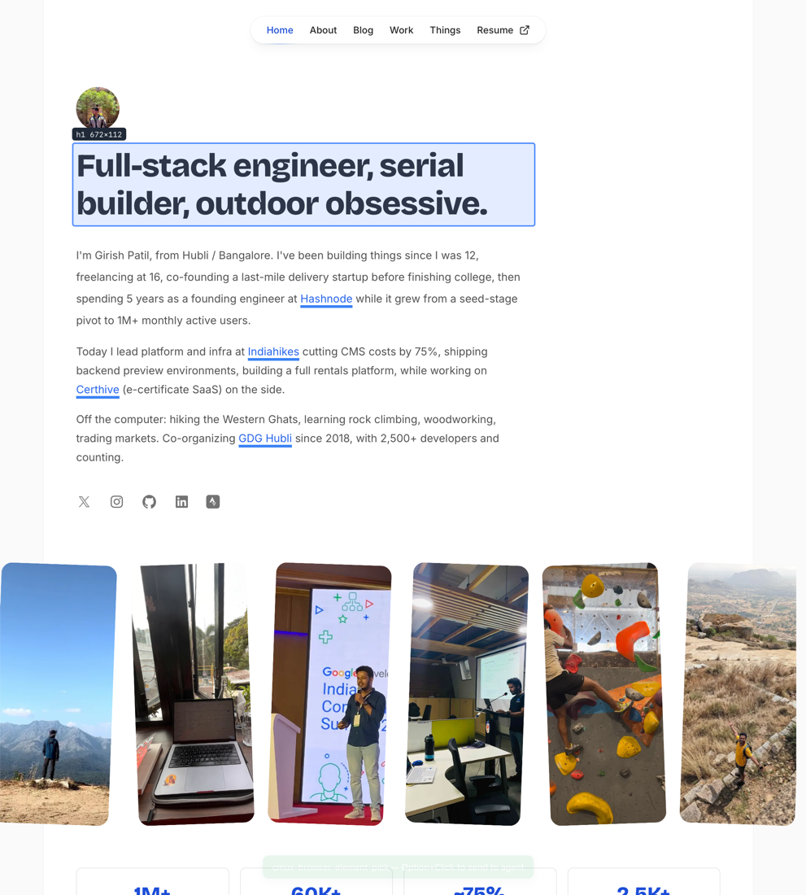

# cmux-browser-element-pick

Click an element in the **cmux** in-app browser and send its **DOM + computed CSS
+ design tokens** straight into your coding agent's pane (Claude Code, Codex,
etc.). It's the "annotate the UI, feed it to the agent" loop, built entirely on
cmux's existing CLI primitives — no Chrome extension, no MCP server, no daemon.



## Why

A coding agent in a terminal can't see what you're looking at in the browser.
cmux-browser-element-pick closes that gap: hover an element, click it, and a clean markdown
context bundle lands where your agent can read it.

## Requirements

- macOS with [cmux](https://cmux.com) installed (the `cmux` CLI on `PATH`).
- Node 18+.
- A cmux workspace with the in-app browser open (`Cmd+Shift+L`) and a coding
  agent running in another pane.

## Install

```sh
npm i -g cmux-browser-element-pick   # provides the `cmux-browser-element-pick` command
cmux-browser-element-pick init                       # adds a Dock control to ~/.config/cmux/dock.json
cmux reload-config                   # pick it up without restarting cmux
```

`cmux-browser-element-pick init` writes (and backs up) `~/.config/cmux/dock.json` so a
**Pick element → agent** control appears in the cmux Dock. Open that control,
open the in-app browser, and Option+Click elements — they land in your agent
pane. Prefer manual setup? See [Launch from the cmux Dock](#launch-from-the-cmux-dock-stays-running).

### From source

```sh
git clone https://github.com/your-handle/cmux-browser-element-pick
cd cmux-browser-element-pick
npm link            # exposes `cmux-browser-element-pick` globally
cmux-browser-element-pick init
```

## How it works

```
cmux-browser-element-pick (driver)
  1. cmux identify / tree   -> find the browser surface + the agent terminal
  2. cmux browser <b> eval  -> inject a hover/click picker into the WKWebView
  3. poll the browser       -> drain clicked elements (window.__cmuxPicks)
  4. write context to a file -> /tmp/cmux-browser-element-pick/pick-*.md (DOM + CSS + tokens)
  5. cmux send <agent>      -> paste a one-line reference into the agent prompt
```

The picker (`src/picker.js`) runs in the page and is **armed by the Option/Alt
modifier**: hold Option to highlight elements, then **Option+Click** to capture.
Plain clicks pass straight through, so normal browsing keeps working while the
picker stays running. A capture grabs `outerHTML` (trimmed), a UI-dev allowlist
of computed CSS, the CSS custom properties (`--*`) the element actually
references, plus selector, xpath and bounding box. `Esc` turns the picker off.
The driver re-injects the picker automatically after you navigate.

By default the full bundle is written to a file and only a **single line**
(prompt-safe, won't auto-submit) is sent to the agent. This is deliberate: cmux
forwards raw newlines as Enter, so dumping a multi-line block inline would
execute line-by-line in a shell. Use `--inline` only with agent TUIs that handle
bracketed paste.

## Usage

```sh
node bin/cmux-browser-element-pick.mjs            # auto-detect browser + agent surfaces
node bin/cmux-browser-element-pick.mjs --enter    # auto-submit each pick to the agent
node bin/cmux-browser-element-pick.mjs --once     # capture one element then exit
node bin/cmux-browser-element-pick.mjs --browser surface:12 --agent surface:11
```

Flags:

| flag | meaning |
|------|---------|
| `--browser surface:N` | browser surface to pick from (default: active/first browser) |
| `--agent surface:M`   | terminal surface to send to (default: caller / sibling terminal) |
| `--enter`             | press Enter after sending (auto-submit to the agent) |
| `--once`              | capture a single element then exit |
| `--inline`            | paste the full block instead of a file reference (agent TUIs only) |
| `--poll <ms>`         | poll interval (default 250) |

Run it, then **Option+Click** elements in the cmux browser. Each pick drops a
context file and a reference into your agent's prompt. `Ctrl+C` in the terminal
stops the driver; `Esc` in the browser stops the picker overlay.

## Launch from the cmux Dock (stays running)

`.cmux/dock.json` adds a sidebar control that runs the picker in its own section.
A Dock control runs its command when the section opens and the driver loops, so
cmux-browser-element-pick stays **armed continuously** — and because capture is gated on
Option+Click, normal browsing is unaffected while it runs.

```json
{
  "controls": [
    { "id": "cmux-browser-element-pick", "title": "Pick element → agent",
      "command": "node ./bin/cmux-browser-element-pick.mjs", "cwd": ".", "height": 200 }
  ]
}
```

cmux shows a trust gate the first time it sees a project Dock config. See
`cmux docs dock`.

When launched from the Dock, cmux-browser-element-pick runs in its own terminal section. It
**excludes that section** when choosing where to send picks, and targets another
terminal — preferring one whose title looks like a coding agent (claude, codex,
opencode, aider, gemini, …). If it guesses wrong, pin the target explicitly:

```json
{ "id": "cmux-browser-element-pick", "title": "Pick element → agent",
  "command": "node ./bin/cmux-browser-element-pick.mjs --agent surface:3", "cwd": "." }
```

## Global install (optional)

```sh
npm link        # or: pnpm -g add file:$(pwd)
cmux-browser-element-pick --help
```

Then point a Dock control or global `~/.config/cmux/dock.json` at `cmux-browser-element-pick`.

## Limitations / roadmap

- macOS + cmux only (by design — uses the cmux browser + socket).
- No source `file:line` mapping yet (Phase 2: React DevTools hook in dev builds).
- Design tokens are resolved from same-origin stylesheets; cross-origin sheets
  are skipped.
- If cmux ships the native element picker
  ([issue #1975](https://github.com/manaflow-ai/cmux/issues/1975)), the
  eval-poll loop can be swapped for native `browser.picked` events.
